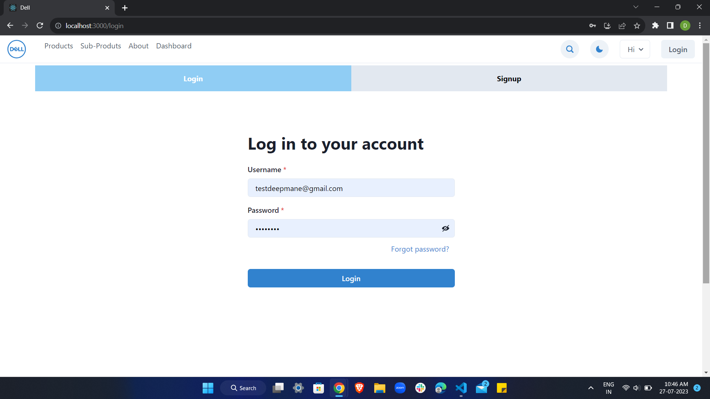
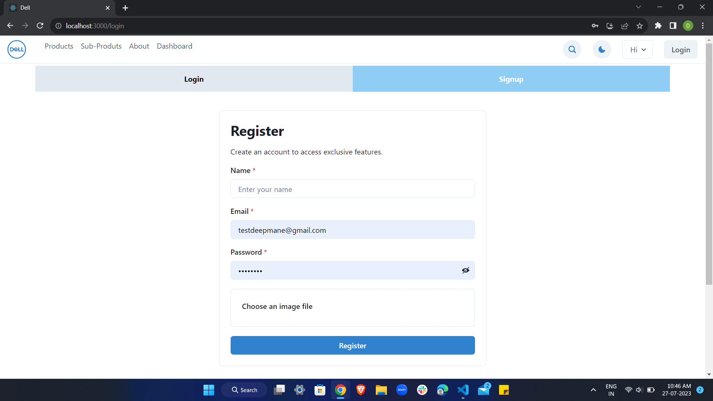
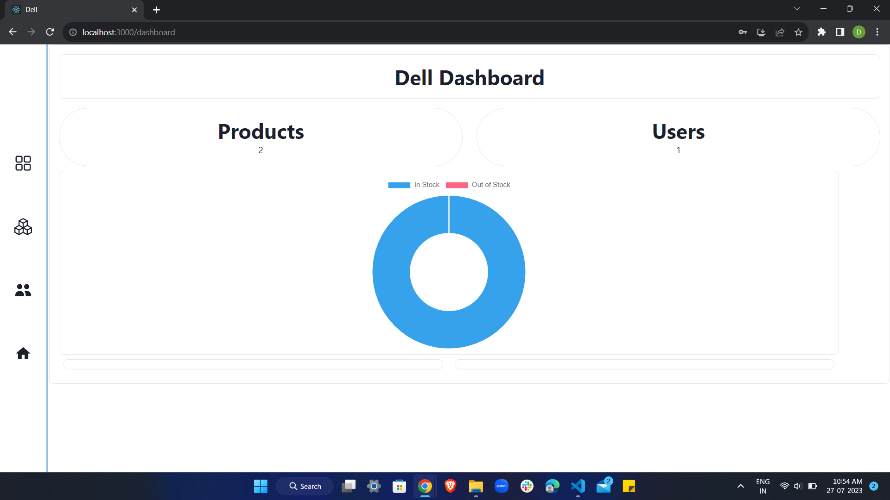
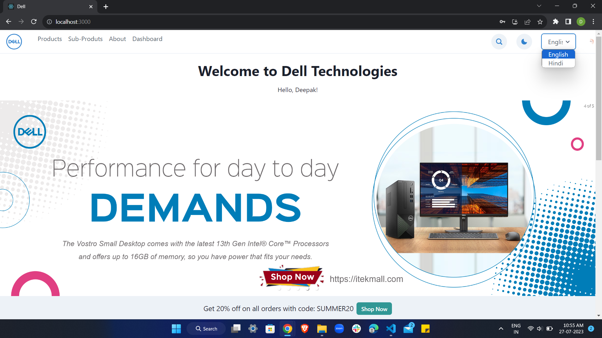
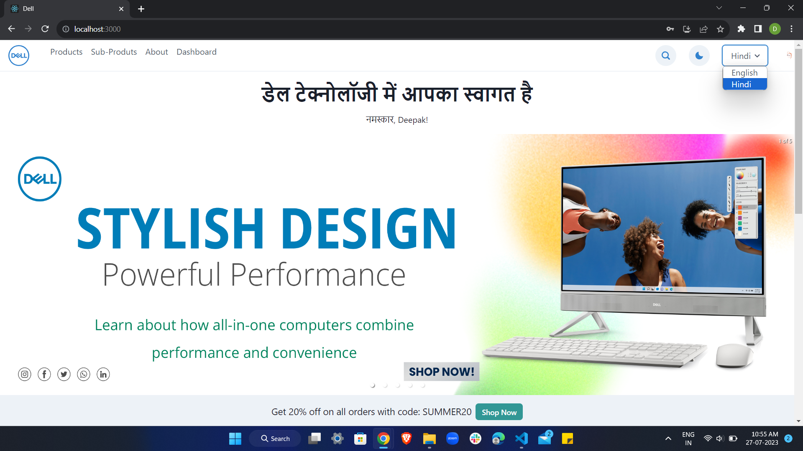
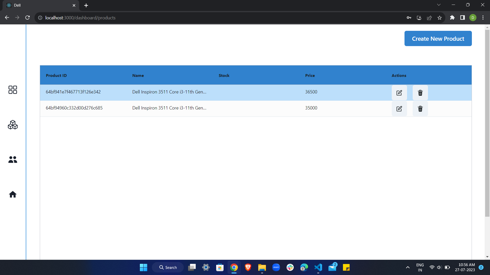
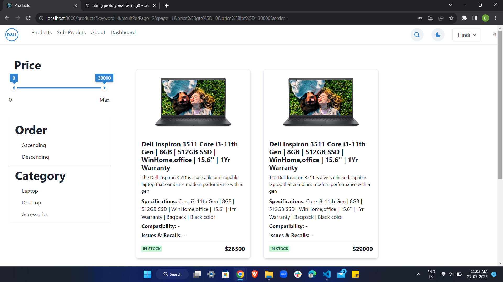
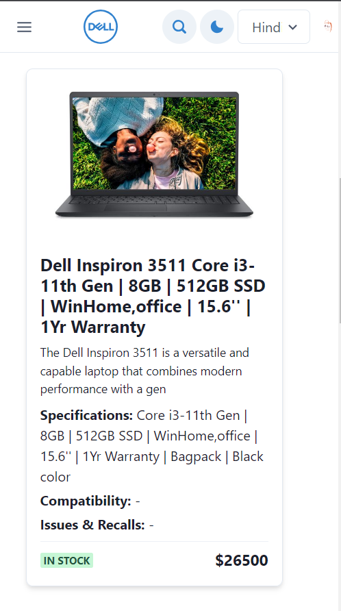
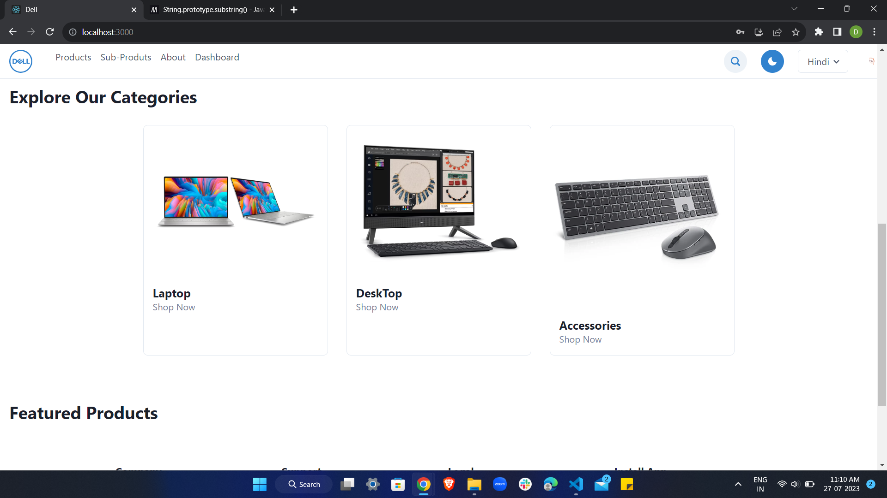
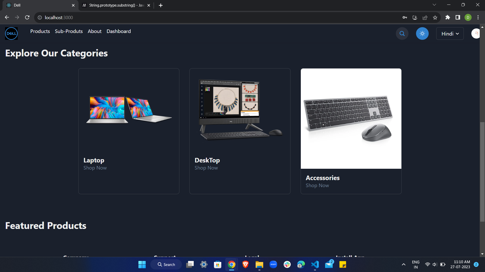

# [Your Project Name]

[Add a brief description or tagline about your project]

## Table of Contents

1. [Introduction](#introduction)
2. [Features](#features)
3. [Tech Stack](#tech-stack)
4. [Installation](#installation)
5. [Contact](#contact)

---

## Introduction

Dell Tech Assignment is a project developed to showcase my skills and expertise in web development. The purpose of this project is to demonstrate my ability to build a full-stack web application using the latest technologies and best practices.

## Features

1. **User Authentication**: Allow users to sign up, log in, and manage their accounts securely.

   
   

2. **Data Visualization with Chart.js**: Visualize complex data sets using Chart.js, enabling users to understand trends and patterns.

   

3. **Multilingual Support with i18next**: Easily support multiple languages and locales to cater to a global audience.

   
   

4. **Efficient Data Grid with ag-Grid React**: Display large datasets with high performance using ag-Grid React's powerful grid capabilities.

   

5. **Responsive UI with Chakra UI**: Create a modern and user-friendly interface that adapts seamlessly across different devices.

   
   

6. **Real-time Updates with React Redux**: Implement real-time updates and state management using React Redux for a seamless user experience.

7. **MongoDB Database Integration**: Store and manage data using MongoDB, a NoSQL database known for its scalability and flexibility.

8. **Interactive Products Page**: Allow user to view all details of proudts , including sorting, filtering, and searching.

9. **Customizable Themes with Chakra UI**: Customize the look and feel of the application with Chakra UI's theme customization options.

   
   

## Tech Stack

The project uses the following technologies:

- Backend:

  -  Node.js
  -  Express
  -  MongoDB

- Frontend:
  -  React
  -  Chakra UI
  -  React Redux
  -  Chart.js
  -  i18next
  -  ag-Grid React

## Installation

To run this project locally, follow these steps:

1. Clone the repository to your local machine:

git clone https://github.com/thedpmane/dell_tech_assignment.git

## Contact

If you have any questions or suggestions regarding the project, please feel free to open an issue or contact us at [thedpmane@email.com].
